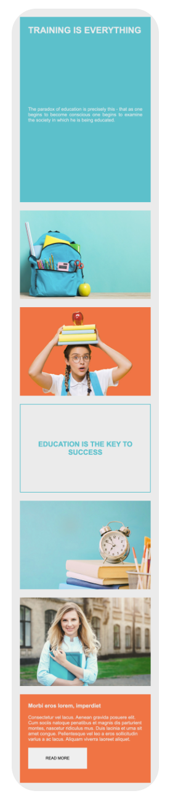
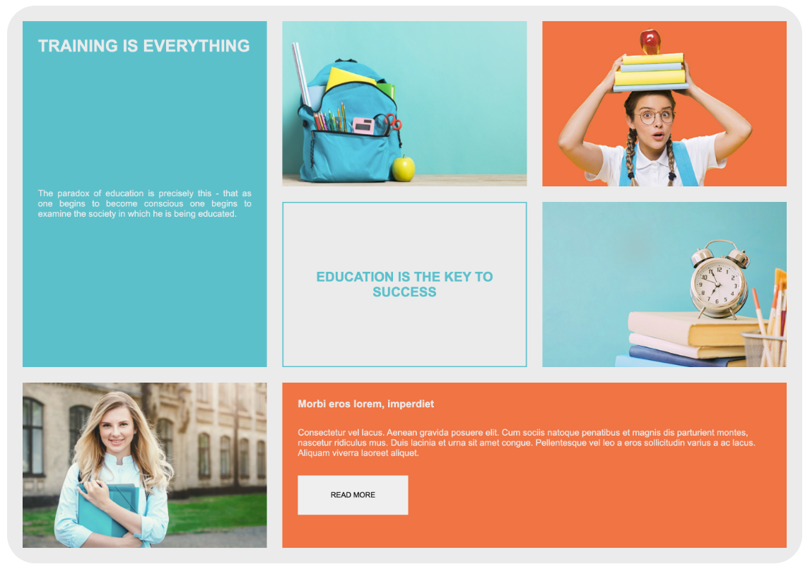

# entrega_grid

Entrega Grid - Master de Ciberseguridad

## Descripción

Este proyecto consiste en una maqueta web basada en **CSS Grid** siguiendo buenas prácticas de maquetación y responsive design. El objetivo es replicar la estructura visual proporcionada, utilizando las imágenes y colores facilitados, y adaptando el diseño para dispositivos móviles y escritorio.

## Estructura HTML

```html
<!DOCTYPE html>
<html lang="en">
  <head>
    <meta charset="UTF-8" />
    <meta name="viewport" content="width=device-width, initial-scale=1.0" />
    <link rel="stylesheet" href="style.css" />
    <title>Grid</title>
  </head>
  <body>
    <header>
      <h1>Training is everything</h1>
      <p>
        The paradox of education is precisely this - that as one begins to
        become conscious one begins to examine the society in which he is being
        educated.
      </p>
    </header>
    <section class="school"></section>
    <section class="student"></section>
    <main><h2>Education is the key to success</h2></main>
    <section class="time"></section>
    <section class="alumni"></section>
    <footer>
      <h3>Morbi eros lorem, imperdiet</h3>
      <p>
        Consectetur vel lacus. Aenean gravida posuere elit. Cum sociis natoque
        penatibus et magnis dis parturient montes, nascetur ridiculus mus. Duis
        lacinia et urna sit amet congue. Pellentesque vel leo a eros
        sollicitudin varius a ac lacus. Aliquam viverra laoreet aliquet.
      </p>
      <button>Read more</button>
    </footer>
  </body>
</html>
```

## Variables y propiedades principales de CSS

```css
:root {
  --primary-color: rgb(236, 236, 236);
  --secondary-color: rgb(21, 21, 21);
  --blue-color: #2bc5cd;
  --orange-color: #ff693d;
  --border: 2px solid var(--blue-color);
  --spacing: 28px;
  font-family: Arial, Helvetica, sans-serif;
}

/* Ejemplo de uso de imágenes de fondo */
.school {
  background-image: url(https://images03.nicepage.com/c461c07a441a5d220e8feb1a/d8ce469044b958508f4bdbab/blueschoolbackpackwithessentialsupplies_232148207678.jpg);
}

.student {
  background-image: url(https://images03.nicepage.com/c461c07a441a5d220e8feb1a/9e4ce16148dd5cbeb1065410/89f80abe-6acd-d8dc-a341-3e571206975b.jpg);
}

.time {
  background-image: url(https://images03.nicepage.com/c461c07a441a5d220e8feb1a/773a5aa425b1502aaac14708/f2b45624-c8f6-3aa0-0ee4-58adda3c89b0.jpg);
}

.alumni {
  background-image: url(https://images03.nicepage.com/c461c07a441a5d220e8feb1a/89993ff69c3e5244ad2bf1ba/blondestudentgirlissmilingholdingfoldernotebookherhandsuniversitybackground_101969664.jpg);
}

.alumni,
.school,
.student,
.time {
  background-size: cover;
}
```

## Requisitos

- Utilizar **display: grid** para la maquetación principal.
- Aplicar las variables de color y tipografía proporcionadas.
- Incluir las imágenes de fondo en las secciones correspondientes.
- Adaptar el diseño para dispositivos móviles (responsive).
- Libertad creativa para personalizar el contenido, siempre manteniendo las buenas prácticas.

## Ejemplo de resultado en móvil



## Ejemplo de resultado en escritorio



---

¡Recuerda adaptar el grid y los estilos para que la web sea totalmente responsive!

---

# entrega_grid (English)

## Description

This project consists of a web mockup based on **CSS Grid**, following best practices for layout and responsive design. The goal is to replicate the provided visual structure, using the supplied images and colors, and adapting the design for both mobile and desktop devices.

## HTML Structure

```html
<!DOCTYPE html>
<html lang="en">
  <head>
    <meta charset="UTF-8" />
    <meta name="viewport" content="width=device-width, initial-scale=1.0" />
    <link rel="stylesheet" href="style.css" />
    <title>Grid</title>
  </head>
  <body>
    <header>
      <h1>Training is everything</h1>
      <p>
        The paradox of education is precisely this - that as one begins to
        become conscious one begins to examine the society in which he is being
        educated.
      </p>
    </header>
    <section class="school"></section>
    <section class="student"></section>
    <main><h2>Education is the key to success</h2></main>
    <section class="time"></section>
    <section class="alumni"></section>
    <footer>
      <h3>Morbi eros lorem, imperdiet</h3>
      <p>
        Consectetur vel lacus. Aenean gravida posuere elit. Cum sociis natoque
        penatibus et magnis dis parturient montes, nascetur ridiculus mus. Duis
        lacinia et urna sit amet congue. Pellentesque vel leo a eros
        sollicitudin varius a ac lacus. Aliquam viverra laoreet aliquet.
      </p>
      <button>Read more</button>
    </footer>
  </body>
</html>
```

## Main CSS Variables and Properties

```css
:root {
  --primary-color: rgb(236, 236, 236);
  --secondary-color: rgb(21, 21, 21);
  --blue-color: #2bc5cd;
  --orange-color: #ff693d;
  --border: 2px solid var(--blue-color);
  --spacing: 28px;
  font-family: Arial, Helvetica, sans-serif;
}

/* Example of background images */
.school {
  background-image: url(https://images03.nicepage.com/c461c07a441a5d220e8feb1a/d8ce469044b958508f4bdbab/blueschoolbackpackwithessentialsupplies_232148207678.jpg);
}

.student {
  background-image: url(https://images03.nicepage.com/c461c07a441a5d220e8feb1a/9e4ce16148dd5cbeb1065410/89f80abe-6acd-d8dc-a341-3e571206975b.jpg);
}

.time {
  background-image: url(https://images03.nicepage.com/c461c07a441a5d220e8feb1a/773a5aa425b1502aaac14708/f2b45624-c8f6-3aa0-0ee4-58adda3c89b0.jpg);
}

.alumni {
  background-image: url(https://images03.nicepage.com/c461c07a441a5d220e8feb1a/89993ff69c3e5244ad2bf1ba/blondestudentgirlissmilingholdingfoldernotebookherhandsuniversitybackground_101969664.jpg);
}

.alumni,
.school,
.student,
.time {
  background-size: cover;
}
```

## Requirements

- Use **display: grid** for the main layout.
- Apply the provided color variables and typography.
- Include the background images in the corresponding sections.
- Adapt the design for mobile devices (responsive).
- Creative freedom to customize the content, always following best practices.

## Mobile Example


## Desktop Example


---

Remember to adapt the grid and styles so that the website is fully responsive!
